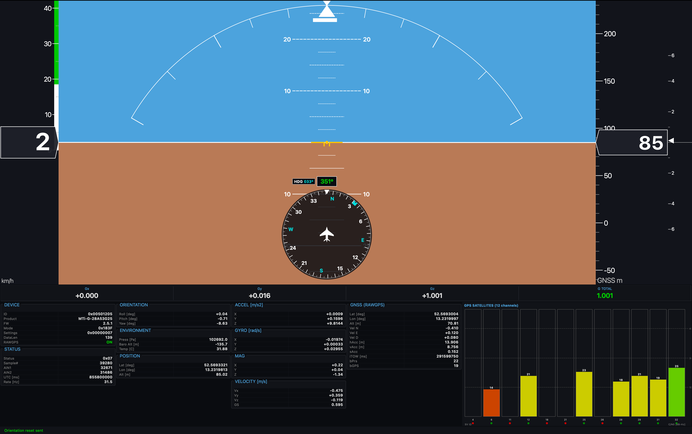
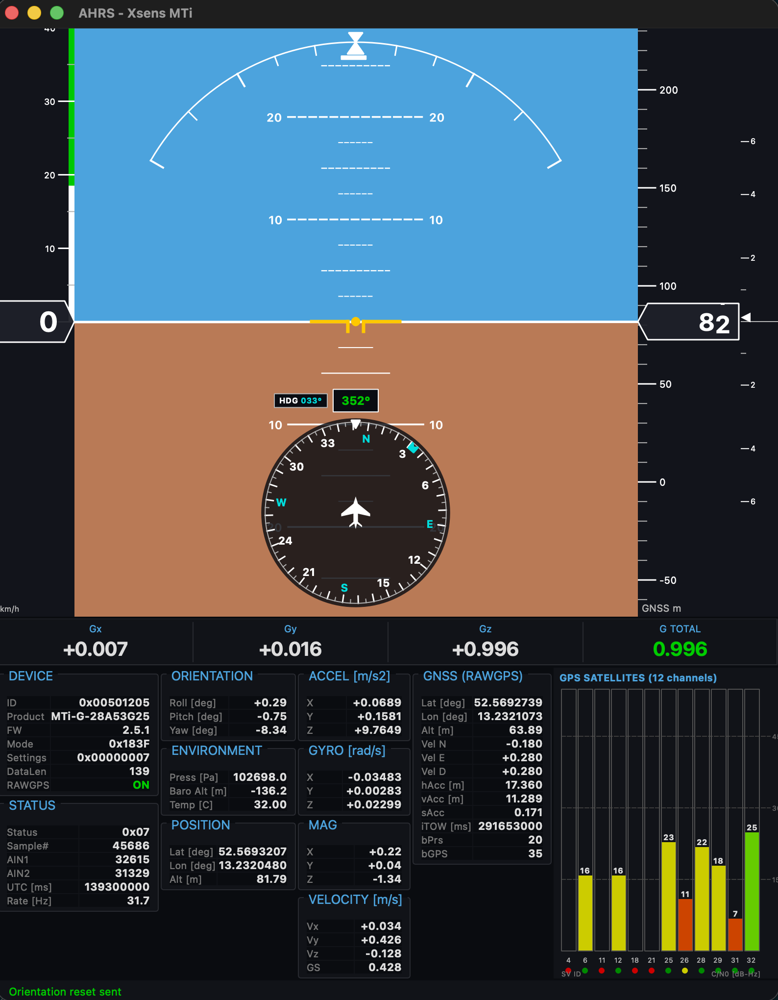

# Xsens MTi-G Primary Flight Display

Full-featured PFD (Primary Flight Display) driven by an Xsens MTi-G IMU/GPS over serial, built with PyQt6.


<p align="center">
  <br>
  <em>Fullscreen with debug panels and GPS satellite view</em>
</p>

<p align="center">
  <br>
  <em>Windowed mode</em>
</p>

## Features

### PFD Instruments
- **Attitude indicator** — selectable source: raw accelerometer (drift-free) or EKF (fused IMU/GPS). Pitch ladder with 2.5° fine marks
- **Bank arc** — slip/skid indicator, auto-calibrated during AHRS alignment
- **Speed tape** — GPS ground speed with GS readout box, rolling drum digits, LP filtering, noise squelch, V-speed color bands (white/green/yellow arcs, red Vne line, barber-pole overspeed)
- **Altitude tape** — selectable source: barometric (QNH corrected) or GNSS. Rolling drum digits, tape label indicates source
- **Compass rose** — rotating 360° HSI with upright labels, aircraft symbol, heading bug with notch marker
- **Vertical speed indicator** — selectable source: GNSS (GPS vertical velocity) or barometric (pressure-derived with two-stage LP filter). Non-linear scale with value readout
- **Flight path vector** (FPV / velocity vector)
- **Heading bug** — adjustable with +/- keys, cyan display with HDG readout
- **GNSS status** — fix status overlay (3D FIX / 2D FIX / SEARCHING / NO FIX) with color coding
- **Fail flags** — red X overlay when data is unavailable (ATT, SPD, ALT, V/S, HDG)
- **AHRS alignment** — startup initialization with progress bar, auto-zero attitude and slip/skid

### Variometer Audio
- **Glider-style vario sound** — beeping tone in climb (500–1500 Hz, 1.7–6.7 beeps/sec), continuous low tone in sink (200–500 Hz), configurable dead band
- Adjustable volume, enable/disable via softkey bar or settings dialog

### Softkey Bar
- **Softkey bar** — 12 fixed button positions at the bottom of the PFD
- Touch-friendly buttons: UNIT, QNH, VARIO (with activity indicator), AHRS, MENU
- Frameless popup dialogs for QNH adjustment and AHRS functions
- Buttons can be dynamically reconfigured for context-sensitive menus

### Data & Configuration
- **Data panels** — raw sensor readouts (accelerometer, gyroscope, magnetometer, GPS, pressure, satellite C/N0 bar graph, G-force), quick-access buttons, toggle with D key
- **Settings dialog** — full device configuration: attitude/altitude/VSI source, QNH, units, V-speed bands, vario audio, auto-zero, filter scenario, gravity magnitude, processing flags, sensor/object alignment, GPS lever arm, magnetic declination, in-run compass calibration, UTC time, transmit delay, sync-out, baudrate, sample rate, error mode, location ID, SetNoRotation
- **Persistent settings** — all user preferences saved to `config.json` and restored on next launch
- **Unit toggle** — metric (km/h, meters, m/s) or imperial (knots, feet, ft/min), V-speed bands convert dynamically

Communicates using the Xsens Mark III legacy protocol (MTData `0x32`).

## Requirements

- Python 3.10+
- Xsens MTi-G connected via USB-serial

## Install

```bash
python -m venv .venv
source .venv/bin/activate
pip install -r requirements.txt
```

## Usage

```bash
python main.py [--port /dev/tty.usbserial-XSU5ZPZX] [--baud 230400] [--windowed]
```

| Argument     | Default                            | Description                              |
|--------------|------------------------------------|------------------------------------------|
| `--port`     | `/dev/tty.usbserial-XSU5ZPZX`     | Serial port                              |
| `--baud`     | `230400`                           | Baud rate                                |
| `--windowed` | off (fullscreen)                   | Start in windowed mode                   |

QNH pressure, units, V-speeds, heading bug, and other settings are persisted in `config.json`.

## Keyboard Shortcuts

| Key   | Action                                          |
|-------|-------------------------------------------------|
| Z     | Level AHRS (set current attitude as zero)       |
| R     | Reset level bias                                |
| C     | Calibrate (orientation reset, keep stationary)  |
| U     | Toggle units (US / Metric)                      |
| D     | Toggle debug data panels                        |
| H     | Sync heading bug to current heading             |
| +/-   | Adjust heading bug by 1°                        |
| M     | Settings menu                                   |
| F     | Toggle fullscreen                               |
| Q/Esc | Quit                                            |

## Architecture

| File                | Purpose                                              |
|---------------------|------------------------------------------------------|
| `main.py`           | Application entry point, softkey bar, popup dialogs  |
| `sensors.py`        | Xsens MTi-G protocol, serial I/O, data parsing      |
| `pfd_widget.py`     | PFD rendering (attitude, tapes, HSI, GNSS status)    |
| `vario_audio.py`    | Variometer audio synthesiser (glider-style beeping)  |
| `data_panels.py`    | Debug data panel strip (sensors, GNSS, satellites)   |
| `settings_dialog.py`| Device and display configuration UI                  |
| `config.py`         | JSON settings persistence                            |
| `diag.py`           | Standalone sensor diagnostic (drift/bias statistics) |
| `test_calibrate.py` | Calibration validation harness                       |

## License

This project is dual-licensed:

- **Open source** — [GNU AGPL-3.0](LICENSE). You may use, modify, and distribute this software freely under AGPL terms. Any networked or distributed derivative work must also be released under AGPL-3.0 with full source code.
- **Commercial** — If you want to use this software in a proprietary/closed-source product without AGPL obligations, contact the author for a commercial license.

## Author

Bjoern Heller <tec@sixtopia.net>
